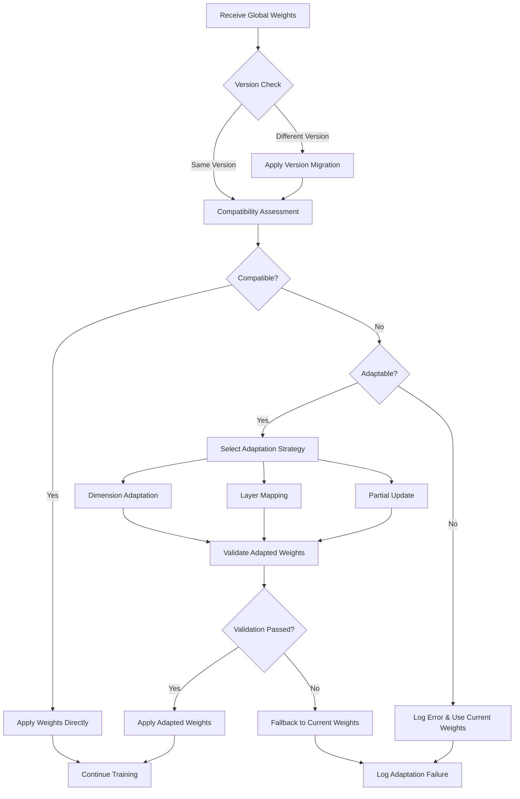

# Weight Adaptation and Compatibility Management

This document provides comprehensive documentation of the weight adaptation mechanism implemented in the federated learning system to handle model architecture differences, version mismatches, and heterogeneous client environments.

## Overview

In distributed federated learning environments, maintaining perfect model architecture consistency across all participants can be challenging. Our weight adaptation system provides robust mechanisms to handle:

- **Architecture Variations**: Minor differences in model implementations
- **Version Evolution**: Gradual changes in model architecture over time  
- **Hardware Constraints**: Client-specific optimizations and limitations
- **Framework Differences**: Variations between deep learning frameworks
- **Dynamic Scaling**: Adaptive model sizing based on client capabilities

The system ensures that federated learning can continue smoothly even when perfect architectural alignment is not possible.

## Architecture Compatibility Challenges

Federated learning systems face several compatibility challenges that traditional centralized ML systems don't encounter:

### 1. Implementation Variations
- **Framework Differences**: TensorFlow vs PyTorch implementations
- **Version Discrepancies**: Different versions of the same framework
- **Platform Optimizations**: Mobile vs desktop vs cloud optimizations
- **Compiler Variations**: Different CUDA versions, hardware-specific optimizations

### 2. Dynamic Architecture Changes
- **Model Evolution**: Gradual improvements to model architecture
- **A/B Testing**: Different model variants in production
- **Incremental Updates**: Adding or removing layers over time
- **Performance Optimization**: Architecture changes for specific client types

### 3. Resource-Driven Adaptations
- **Memory Constraints**: Reduced model size for resource-limited clients
- **Computational Limits**: Simplified architectures for edge devices
- **Bandwidth Limitations**: Compressed models for low-bandwidth clients
- **Power Efficiency**: Optimized models for battery-powered devices

### 4. Data Distribution Effects
- **Non-IID Adaptations**: Client-specific architecture modifications
- **Domain-Specific Layers**: Additional layers for specific data types
- **Task Variations**: Multi-task learning with varying output layers
- **Privacy Requirements**: Architecture changes for differential privacy

The most critical compatibility issues include:

```python
# Common compatibility problems encountered
compatibility_issues = {
    'dimension_mismatch': {
        'description': 'Layer dimensions don\'t match between server and client',
        'frequency': 'High',
        'impact': 'Critical',
        'examples': [
            'Flattened layer size differences: (6272,) vs (6400,)',
            'Dense layer mismatches: (64, 10) vs (64, 12)',
            'Conv filter count differences: (16,) vs (32,)'
        ]
    },
    'layer_count_mismatch': {
        'description': 'Different number of layers in model',
        'frequency': 'Medium',
        'impact': 'High',
        'examples': [
            'Missing batch normalization layers',
            'Additional dropout layers on client',
            'Different activation layer implementations'
        ]
    },
    'parameter_type_mismatch': {
        'description': 'Different parameter types or precision',
        'frequency': 'Low',
        'impact': 'Medium',
        'examples': [
            'float32 vs float16 precision',
            'Different weight initialization schemes',
            'Quantized vs full-precision weights'
        ]
    }
}
```

## Comprehensive Weight Adaptation System

Our system implements a multi-layered approach to weight compatibility, providing several levels of adaptation mechanisms:

### 1. Compatibility Assessment Framework

```python
import numpy as np
import logging
from typing import List, Dict, Tuple, Optional, Any
from dataclasses import dataclass

@dataclass
class CompatibilityReport:
    """Detailed compatibility assessment report."""
    is_compatible: bool
    issues: List[str]
    adaptable_issues: List[str]
    critical_issues: List[str]
    adaptation_strategy: Optional[str]
    confidence_score: float
    
class WeightCompatibilityChecker:
    """Advanced weight compatibility assessment."""
    
    def __init__(self):
        self.tolerance = 1e-6
        self.adaptation_strategies = [
            'exact_match',
            'dimension_padding',
            'dimension_truncation',
            'layer_mapping',
            'partial_update',
            'interpolation'
        ]
    
    def assess_compatibility(self, model_weights: List[np.ndarray], 
                           received_weights: List[np.ndarray]) -> CompatibilityReport:
        """
        Comprehensive compatibility assessment between model and received weights.
        
        Args:
            model_weights: Current model weights
            received_weights: Weights received from server/aggregation
            
        Returns:
            CompatibilityReport: Detailed assessment with adaptation recommendations
        """
        issues = []
        adaptable_issues = []
        critical_issues = []
        
        # Basic compatibility checks
        if len(model_weights) != len(received_weights):
            issue = f"Weight count mismatch: {len(model_weights)} vs {len(received_weights)}"
            if abs(len(model_weights) - len(received_weights)) <= 2:
                adaptable_issues.append(issue)
            else:
                critical_issues.append(issue)
        
        # Shape compatibility analysis
        shape_mismatches = []
        for i, (model_w, recv_w) in enumerate(zip(model_weights, received_weights)):
            if model_w.shape != recv_w.shape:
                shape_info = {
                    'layer_index': i,
                    'model_shape': model_w.shape,
                    'received_shape': recv_w.shape,
                    'adaptable': self._is_shape_adaptable(model_w.shape, recv_w.shape)
                }
                shape_mismatches.append(shape_info)
                
                issue_desc = f"Layer {i}: {model_w.shape} vs {recv_w.shape}"
                if shape_info['adaptable']:
                    adaptable_issues.append(issue_desc)
                else:
                    critical_issues.append(issue_desc)
        
        # Determine overall compatibility and strategy
        is_compatible = len(critical_issues) == 0
        adaptation_strategy = self._select_adaptation_strategy(
            shape_mismatches, len(adaptable_issues)
        )
        
        confidence_score = self._calculate_confidence_score(
            model_weights, received_weights, shape_mismatches
        )
        
        return CompatibilityReport(
            is_compatible=is_compatible,
            issues=issues,
            adaptable_issues=adaptable_issues,
            critical_issues=critical_issues,
            adaptation_strategy=adaptation_strategy,
            confidence_score=confidence_score
        )
    
    def _is_shape_adaptable(self, model_shape: Tuple, received_shape: Tuple) -> bool:
        """Determine if shape mismatch can be adapted."""
        if len(model_shape) != len(received_shape):
            return False
        
        # 1D arrays (biases) - can pad/truncate
        if len(model_shape) == 1:
            return True
        
        # 2D arrays (dense layers) - can adapt if one dimension matches
        if len(model_shape) == 2:
            return (model_shape[0] == received_shape[0] or 
                   model_shape[1] == received_shape[1])
        
        # 4D arrays (conv layers) - more restrictive adaptation
        if len(model_shape) == 4:
            # Can adapt filter count if other dimensions match
            return (model_shape[0:3] == received_shape[0:3] or
                   model_shape[1:4] == received_shape[1:4])
        
        return False
    
    def _select_adaptation_strategy(self, shape_mismatches: List[Dict], 
                                  adaptable_count: int) -> Optional[str]:
        """Select the best adaptation strategy based on compatibility analysis."""
        if not shape_mismatches:
            return 'exact_match'
        
        if adaptable_count == 0:
            return None
        
        # Analyze types of mismatches to select strategy
        has_dense_mismatch = any(len(sm['model_shape']) == 2 for sm in shape_mismatches)
        has_conv_mismatch = any(len(sm['model_shape']) == 4 for sm in shape_mismatches)
        
        if has_dense_mismatch and not has_conv_mismatch:
            return 'dimension_adaptation'
        elif has_conv_mismatch and not has_dense_mismatch:
            return 'filter_adaptation'
        elif adaptable_count < len(shape_mismatches) // 2:
            return 'partial_update'
        else:
            return 'layer_mapping'
    
    def _calculate_confidence_score(self, model_weights: List[np.ndarray],
                                  received_weights: List[np.ndarray],
                                  shape_mismatches: List[Dict]) -> float:
        """Calculate confidence score for adaptation success."""
        if not shape_mismatches:
            return 1.0
        
        total_params_model = sum(w.size for w in model_weights)
        adaptable_params = 0
        
        for i, (model_w, recv_w) in enumerate(zip(model_weights, received_weights)):
            mismatch_info = next((sm for sm in shape_mismatches if sm['layer_index'] == i), None)
            if mismatch_info is None or mismatch_info['adaptable']:
                adaptable_params += min(model_w.size, recv_w.size)
        
        return adaptable_params / total_params_model if total_params_model > 0 else 0.0
```

### 2. Advanced Weight Adaptation Algorithms

```python
class AdvancedWeightAdapter:
    """Sophisticated weight adaptation with multiple strategies."""
    
    def __init__(self, config: Dict[str, Any] = None):
        self.config = config or {
            'padding_strategy': 'zero',  # 'zero', 'random', 'mean'
            'truncation_strategy': 'random',  # 'random', 'magnitude', 'importance'
            'interpolation_method': 'linear',  # 'linear', 'cubic', 'nearest'
            'adaptation_threshold': 0.1,  # Maximum relative size difference to allow
            'preserve_magnitude': True,  # Preserve weight magnitude during adaptation
            'use_smart_padding': True,  # Use data-driven padding strategies
        }
    
    def adapt_weights_comprehensive(self, model_weights: List[np.ndarray],
                                  received_weights: List[np.ndarray],
                                  compatibility_report: CompatibilityReport) -> Tuple[List[np.ndarray], Dict]:
        """
        Comprehensive weight adaptation using multiple strategies.
        
        Returns:
            Tuple[adapted_weights, adaptation_metadata]
        """
        if compatibility_report.adaptation_strategy == 'exact_match':
            return received_weights, {'strategy': 'exact_match', 'success': True}
        
        if compatibility_report.adaptation_strategy is None:
            return model_weights, {'strategy': 'fallback', 'success': False}
        
        adapted_weights = []
        adaptation_metadata = {
            'strategy': compatibility_report.adaptation_strategy,
            'adaptations_performed': [],
            'success': True,
            'confidence': compatibility_report.confidence_score
        }
        
        for i, (model_w, recv_w) in enumerate(zip(model_weights, received_weights)):
            if model_w.shape == recv_w.shape:
                adapted_weights.append(recv_w)
                continue
            
            # Attempt adaptation based on strategy
            try:
                adapted_w = self._adapt_single_weight(model_w, recv_w, i)
                adapted_weights.append(adapted_w)
                adaptation_metadata['adaptations_performed'].append({
                    'layer': i,
                    'original_shape': recv_w.shape,
                    'adapted_shape': adapted_w.shape,
                    'method': self._get_adaptation_method(model_w.shape, recv_w.shape)
                })
            except Exception as e:
                logging.error(f"Failed to adapt layer {i}: {e}")
                adapted_weights.append(model_w)  # Fallback to original
                adaptation_metadata['success'] = False
        
        return adapted_weights, adaptation_metadata
    
    def _adapt_single_weight(self, model_weight: np.ndarray, 
                           received_weight: np.ndarray, layer_index: int) -> np.ndarray:
        """Adapt a single weight array to match model requirements."""
        model_shape = model_weight.shape
        recv_shape = received_weight.shape
        
        # 1D adaptation (biases)
        if len(model_shape) == 1:
            return self._adapt_1d_weight(model_weight, received_weight)
        
        # 2D adaptation (dense layers)
        elif len(model_shape) == 2:
            return self._adapt_2d_weight(model_weight, received_weight)
        
        # 4D adaptation (convolutional layers)
        elif len(model_shape) == 4:
            return self._adapt_4d_weight(model_weight, received_weight)
        
        else:
            raise ValueError(f"Unsupported weight dimensionality: {len(model_shape)}")
    
    def _adapt_1d_weight(self, model_weight: np.ndarray, 
                        received_weight: np.ndarray) -> np.ndarray:
        """Adapt 1D weight arrays (biases)."""
        if model_weight.shape[0] > received_weight.shape[0]:
            # Pad received weight
            padding_size = model_weight.shape[0] - received_weight.shape[0]
            if self.config['padding_strategy'] == 'zero':
                padding = np.zeros(padding_size, dtype=received_weight.dtype)
            elif self.config['padding_strategy'] == 'mean':
                padding = np.full(padding_size, received_weight.mean(), dtype=received_weight.dtype)
            elif self.config['padding_strategy'] == 'random':
                std = received_weight.std() if received_weight.size > 1 else 0.1
                padding = np.random.normal(0, std, padding_size).astype(received_weight.dtype)
            
            return np.concatenate([received_weight, padding])
        else:
            # Truncate received weight
            if self.config['truncation_strategy'] == 'random':
                indices = np.random.choice(received_weight.shape[0], model_weight.shape[0], replace=False)
                return received_weight[indices]
            else:
                return received_weight[:model_weight.shape[0]]
    
    def _adapt_2d_weight(self, model_weight: np.ndarray, 
                        received_weight: np.ndarray) -> np.ndarray:
        """Adapt 2D weight arrays (dense layers)."""
        model_rows, model_cols = model_weight.shape
        recv_rows, recv_cols = received_weight.shape
        
        adapted_weight = received_weight.copy()
        
        # Adapt rows (input dimension)
        if model_rows != recv_rows:
            if model_rows > recv_rows:
                # Pad rows
                padding_rows = model_rows - recv_rows
                if self.config['use_smart_padding']:
                    # Use Xavier/He initialization for padding
                    fan_in = recv_cols
                    std = np.sqrt(2.0 / fan_in)  # He initialization
                    padding = np.random.normal(0, std, (padding_rows, recv_cols)).astype(received_weight.dtype)
                else:
                    padding = np.zeros((padding_rows, recv_cols), dtype=received_weight.dtype)
                
                adapted_weight = np.vstack([adapted_weight, padding])
            else:
                # Truncate rows based on magnitude
                if self.config['truncation_strategy'] == 'magnitude':
                    row_magnitudes = np.linalg.norm(adapted_weight, axis=1)
                    indices = np.argsort(row_magnitudes)[-model_rows:]
                    adapted_weight = adapted_weight[indices]
                else:
                    adapted_weight = adapted_weight[:model_rows]
        
        # Adapt columns (output dimension)
        if model_cols != adapted_weight.shape[1]:
            if model_cols > adapted_weight.shape[1]:
                # Pad columns
                padding_cols = model_cols - adapted_weight.shape[1]
                if self.config['use_smart_padding']:
                    fan_out = model_cols
                    std = np.sqrt(2.0 / fan_out)
                    padding = np.random.normal(0, std, (adapted_weight.shape[0], padding_cols)).astype(received_weight.dtype)
                else:
                    padding = np.zeros((adapted_weight.shape[0], padding_cols), dtype=received_weight.dtype)
                
                adapted_weight = np.hstack([adapted_weight, padding])
            else:
                # Truncate columns
                adapted_weight = adapted_weight[:, :model_cols]
        
        return adapted_weight
    
    def _adapt_4d_weight(self, model_weight: np.ndarray, 
                        received_weight: np.ndarray) -> np.ndarray:
        """Adapt 4D weight arrays (convolutional layers)."""
        # For conv layers, we're more conservative
        # Only adapt if kernel size and input channels match
        model_h, model_w, model_ic, model_oc = model_weight.shape
        recv_h, recv_w, recv_ic, recv_oc = received_weight.shape
        
        if (model_h, model_w, model_ic) != (recv_h, recv_w, recv_ic):
            raise ValueError("Cannot adapt conv weights with different kernel size or input channels")
        
        # Only adapt output channels
        if model_oc > recv_oc:
            # Add new filters
            padding_filters = model_oc - recv_oc
            if self.config['use_smart_padding']:
                # Initialize new filters with small random values
                fan_in = model_h * model_w * model_ic
                std = np.sqrt(2.0 / fan_in)
                padding = np.random.normal(0, std, (model_h, model_w, model_ic, padding_filters)).astype(received_weight.dtype)
            else:
                padding = np.zeros((model_h, model_w, model_ic, padding_filters), dtype=received_weight.dtype)
            
            return np.concatenate([received_weight, padding], axis=3)
        elif model_oc < recv_oc:
            # Remove filters (keep most important ones based on magnitude)
            filter_magnitudes = np.linalg.norm(received_weight.reshape(-1, recv_oc), axis=0)
            indices = np.argsort(filter_magnitudes)[-model_oc:]
            return received_weight[:, :, :, indices]
        
        return received_weight
    
    def _get_adaptation_method(self, model_shape: Tuple, recv_shape: Tuple) -> str:
        """Get the adaptation method used for a specific shape combination."""
        if model_shape == recv_shape:
            return 'exact_match'
        elif len(model_shape) == 1:
            return 'bias_adaptation'
        elif len(model_shape) == 2:
            return 'dense_adaptation'
        elif len(model_shape) == 4:
            return 'conv_adaptation'
        else:
            return 'unknown'
```
### 3. Intelligent Layer Mapping System

```python
class LayerMapper:
    """Advanced layer mapping for complex architecture differences."""
    
    def __init__(self):
        self.layer_type_signatures = {
            'conv2d': {'dims': 4, 'pattern': 'HWIO'},
            'dense': {'dims': 2, 'pattern': 'IO'},
            'bias': {'dims': 1, 'pattern': 'O'},
            'batch_norm_gamma': {'dims': 1, 'pattern': 'O'},
            'batch_norm_beta': {'dims': 1, 'pattern': 'O'},
            'batch_norm_mean': {'dims': 1, 'pattern': 'O'},
            'batch_norm_var': {'dims': 1, 'pattern': 'O'}
        }
    
    def create_layer_mapping(self, source_weights: List[np.ndarray], 
                           target_weights: List[np.ndarray]) -> Dict[int, int]:
        """
        Create intelligent mapping between source and target layer indices.
        
        Returns:
            Dict mapping source indices to target indices
        """
        source_signatures = [self._get_layer_signature(w) for w in source_weights]
        target_signatures = [self._get_layer_signature(w) for w in target_weights]
        
        mapping = {}
        used_targets = set()
        
        # First pass: exact matches
        for src_idx, src_sig in enumerate(source_signatures):
            for tgt_idx, tgt_sig in enumerate(target_signatures):
                if tgt_idx in used_targets:
                    continue
                if src_sig == tgt_sig:
                    mapping[src_idx] = tgt_idx
                    used_targets.add(tgt_idx)
                    break
        
        # Second pass: compatible matches
        for src_idx, src_sig in enumerate(source_signatures):
            if src_idx in mapping:
                continue
            
            for tgt_idx, tgt_sig in enumerate(target_signatures):
                if tgt_idx in used_targets:
                    continue
                if self._are_signatures_compatible(src_sig, tgt_sig):
                    mapping[src_idx] = tgt_idx
                    used_targets.add(tgt_idx)
                    break
        
        return mapping
    
    def _get_layer_signature(self, weight: np.ndarray) -> Dict[str, Any]:
        """Extract layer signature from weight array."""
        signature = {
            'shape': weight.shape,
            'dims': len(weight.shape),
            'size': weight.size,
            'type': self._infer_layer_type(weight.shape)
        }
        return signature
    
    def _infer_layer_type(self, shape: Tuple[int, ...]) -> str:
        """Infer layer type from weight shape."""
        if len(shape) == 4:
            return 'conv2d'
        elif len(shape) == 2:
            return 'dense'
        elif len(shape) == 1:
            return 'bias'  # Could also be batch norm parameters
        else:
            return 'unknown'
    
    def _are_signatures_compatible(self, sig1: Dict, sig2: Dict) -> bool:
        """Check if two layer signatures are compatible for adaptation."""
        if sig1['type'] != sig2['type']:
            return False
        
        if sig1['type'] in ['conv2d', 'dense']:
            # Check if adaptation is possible
            return True  # Will be validated in adaptation phase
        elif sig1['type'] == 'bias':
            return True  # Bias can usually be adapted
        
        return False

### 4. Version-Aware Weight Management

```python
class VersionAwareWeightManager:
    """Manages weight compatibility across different model versions."""
    
    def __init__(self):
        self.version_registry = {}
        self.migration_rules = {}
    
    def register_model_version(self, version: str, weight_schema: Dict[str, Any]):
        """Register a model version with its weight schema."""
        self.version_registry[version] = {
            'schema': weight_schema,
            'timestamp': time.time(),
            'layer_count': weight_schema.get('layer_count', 0),
            'total_params': weight_schema.get('total_params', 0)
        }
    
    def add_migration_rule(self, from_version: str, to_version: str, 
                          migration_func: callable):
        """Add a migration rule between versions."""
        key = f"{from_version}->{to_version}"
        self.migration_rules[key] = migration_func
    
    def migrate_weights(self, weights: List[np.ndarray], 
                       from_version: str, to_version: str) -> List[np.ndarray]:
        """Migrate weights from one version to another."""
        migration_key = f"{from_version}->{to_version}"
        
        if migration_key in self.migration_rules:
            return self.migration_rules[migration_key](weights)
        
        # Try to find a migration path
        path = self._find_migration_path(from_version, to_version)
        if path:
            current_weights = weights
            for i in range(len(path) - 1):
                step_key = f"{path[i]}->{path[i+1]}"
                if step_key in self.migration_rules:
                    current_weights = self.migration_rules[step_key](current_weights)
                else:
                    raise ValueError(f"No migration rule for {step_key}")
            return current_weights
        
        raise ValueError(f"No migration path from {from_version} to {to_version}")
    
    def _find_migration_path(self, from_version: str, to_version: str) -> Optional[List[str]]:
        """Find a migration path between versions using BFS."""
        if from_version == to_version:
            return [from_version]
        
        # Build graph of available migrations
        graph = {}
        for rule_key in self.migration_rules.keys():
            from_v, to_v = rule_key.split('->')
            if from_v not in graph:
                graph[from_v] = []
            graph[from_v].append(to_v)
        
        # BFS to find shortest path
        queue = [(from_version, [from_version])]
        visited = {from_version}
        
        while queue:
            current, path = queue.pop(0)
            
            if current == to_version:
                return path
            
            for neighbor in graph.get(current, []):
                if neighbor not in visited:
                    visited.add(neighbor)
                    queue.append((neighbor, path + [neighbor]))
        
        return None

# Example migration functions
def migrate_v1_to_v2(weights: List[np.ndarray]) -> List[np.ndarray]:
    """Migration from v1 to v2: adds batch normalization layers."""
    migrated = []
    for i, w in enumerate(weights):
        migrated.append(w)
        # Add batch norm parameters after conv layers
        if len(w.shape) == 4:  # Conv layer
            num_filters = w.shape[-1]
            # Add gamma, beta, mean, var
            migrated.extend([
                np.ones(num_filters, dtype=w.dtype),     # gamma
                np.zeros(num_filters, dtype=w.dtype),    # beta
                np.zeros(num_filters, dtype=w.dtype),    # mean
                np.ones(num_filters, dtype=w.dtype)      # var
            ])
    return migrated

def migrate_v2_to_v3(weights: List[np.ndarray]) -> List[np.ndarray]:
    """Migration from v2 to v3: doubles the number of filters in first conv layer."""
    migrated = []
    for i, w in enumerate(weights):
        if i == 0 and len(w.shape) == 4:  # First conv layer
            # Double the number of filters
            doubled_w = np.concatenate([w, w], axis=-1)
            migrated.append(doubled_w)
        else:
            migrated.append(w)
    return migrated
```

## Complete Integration Example

Here's how all the components work together in practice:

```python
# In client.py or federated learning client
class FederatedClient:
    def __init__(self, client_id: str, model_config: Dict):
        self.client_id = client_id
        self.model = create_model(model_config)
        self.compatibility_checker = WeightCompatibilityChecker()
        self.weight_adapter = AdvancedWeightAdapter()
        self.layer_mapper = LayerMapper()
        self.version_manager = VersionAwareWeightManager()
        
        # Register current model version
        self.current_version = model_config.get('version', '1.0')
        self.version_manager.register_model_version(
            self.current_version,
            self._get_model_schema()
        )
    
    def receive_global_weights(self, global_weights: List[np.ndarray], 
                             server_version: str = None) -> bool:
        """
        Receive and adapt global weights from federated server.
        
        Returns:
            bool: True if weights were successfully applied
        """
        try:
            # Version handling
            if server_version and server_version != self.current_version:
                logging.info(f"Version mismatch: client {self.current_version}, server {server_version}")
                global_weights = self.version_manager.migrate_weights(
                    global_weights, server_version, self.current_version
                )
            
            # Compatibility assessment
            model_weights = self.model.get_weights()
            compatibility_report = self.compatibility_checker.assess_compatibility(
                model_weights, global_weights
            )
            
            logging.info(f"Compatibility assessment: {compatibility_report.adaptation_strategy} "
                        f"(confidence: {compatibility_report.confidence_score:.2f})")
            
            # Weight adaptation
            if compatibility_report.is_compatible or compatibility_report.adaptation_strategy:
                adapted_weights, metadata = self.weight_adapter.adapt_weights_comprehensive(
                    model_weights, global_weights, compatibility_report
                )
                
                if metadata['success']:
                    self.model.set_weights(adapted_weights)
                    self._log_adaptation_success(metadata)
                    return True
                else:
                    self._log_adaptation_failure(metadata)
                    return False
            else:
                logging.error("Weights incompatible and cannot be adapted")
                self._log_compatibility_issues(compatibility_report)
                return False
                
        except Exception as e:
            logging.error(f"Error receiving global weights: {e}")
            return False
    
    def _get_model_schema(self) -> Dict[str, Any]:
        """Extract model schema for version management."""
        weights = self.model.get_weights()
        return {
            'layer_count': len(weights),
            'total_params': sum(w.size for w in weights),
            'shapes': [w.shape for w in weights],
            'dtypes': [str(w.dtype) for w in weights]
        }
    
    def _log_adaptation_success(self, metadata: Dict):
        """Log successful weight adaptation."""
        logging.info(f"Successfully adapted weights using strategy: {metadata['strategy']}")
        for adaptation in metadata['adaptations_performed']:
            logging.debug(f"Layer {adaptation['layer']}: {adaptation['original_shape']} -> "
                         f"{adaptation['adapted_shape']} ({adaptation['method']})")
    
    def _log_adaptation_failure(self, metadata: Dict):
        """Log weight adaptation failure."""
        logging.error(f"Weight adaptation failed with strategy: {metadata['strategy']}")
    
    def _log_compatibility_issues(self, report: CompatibilityReport):
        """Log detailed compatibility issues."""
        logging.error("Compatibility issues found:")
        for issue in report.critical_issues:
            logging.error(f"  Critical: {issue}")
        for issue in report.adaptable_issues:
            logging.warning(f"  Adaptable: {issue}")

# Usage example
client = FederatedClient("client_1", {"version": "2.0", "filters": [16, 32]})

# Receive weights from server
server_weights = receive_weights_from_server()  # Implementation depends on communication method
success = client.receive_global_weights(server_weights, server_version="1.9")

if success:
    # Continue with local training
    client.train_local_model()
else:
    # Handle adaptation failure
    logging.error("Failed to adapt server weights, using current model")
```

## Adaptation Process Flow

The weight adaptation system follows a systematic approach:



### Detailed Process Steps

1. **Reception Phase**
   - Receive serialized weights from server/aggregator
   - Deserialize weights into numpy arrays
   - Extract metadata (version, checksums, etc.)

2. **Version Reconciliation**
   - Compare client and server model versions
   - Apply version-specific migration rules if needed
   - Update weight structure to match client expectations

3. **Compatibility Analysis**
   - Assess structural compatibility
   - Identify adaptable vs. critical mismatches
   - Calculate adaptation confidence score
   - Select optimal adaptation strategy

4. **Weight Adaptation**
   - Apply selected adaptation algorithm
   - Handle dimension mismatches through padding/truncation
   - Perform layer mapping for structural differences
   - Preserve weight magnitudes and distributions

5. **Validation and Application**
   - Validate adapted weights against model requirements
   - Perform sanity checks (gradient flow, parameter ranges)
   - Apply weights to model if validation passes
   - Log adaptation results and metadata

6. **Fallback Handling**
   - Maintain current weights if adaptation fails
   - Log detailed failure information
   - Optionally request alternative weights from server
   - Continue with local training using existing weights

## Advanced Use Cases and Scenarios

### 1. Heterogeneous Client Environments

```python
# Configuration for different client types
client_configs = {
    'mobile_device': {
        'model_variant': 'lightweight',
        'filters': [8, 16],
        'dense_units': 32,
        'adaptation_strategy': 'aggressive_compression'
    },
    'edge_server': {
        'model_variant': 'standard',
        'filters': [16, 32],
        'dense_units': 64,
        'adaptation_strategy': 'conservative'
    },
    'cloud_instance': {
        'model_variant': 'enhanced',
        'filters': [32, 64, 128],
        'dense_units': 128,
        'adaptation_strategy': 'full_precision'
    }
}

class HeterogeneousAdapter:
    """Adapter for heterogeneous client environments."""
    
    def adapt_for_client_type(self, global_weights: List[np.ndarray], 
                             client_type: str) -> List[np.ndarray]:
        """Adapt global weights for specific client type."""
        config = client_configs[client_type]
        
        if config['model_variant'] == 'lightweight':
            return self._create_lightweight_weights(global_weights, config)
        elif config['model_variant'] == 'enhanced':
            return self._create_enhanced_weights(global_weights, config)
        else:
            return global_weights
    
    def _create_lightweight_weights(self, weights: List[np.ndarray], 
                                  config: Dict) -> List[np.ndarray]:
        """Create lightweight version by reducing model complexity."""
        adapted = []
        for w in weights:
            if len(w.shape) == 4:  # Conv layer
                # Reduce number of filters
                target_filters = min(w.shape[-1], config['filters'][0])
                adapted.append(w[:, :, :, :target_filters])
            elif len(w.shape) == 2:  # Dense layer
                # Reduce dense units
                if w.shape[1] > config['dense_units']:
                    adapted.append(w[:, :config['dense_units']])
                else:
                    adapted.append(w)
            else:
                adapted.append(w)
        return adapted
```

### 2. Dynamic Model Evolution

```python
class EvolutionaryAdapter:
    """Handles dynamic model architecture evolution."""
    
    def __init__(self):
        self.evolution_history = []
        self.adaptation_cache = {}
    
    def evolve_architecture(self, current_weights: List[np.ndarray], 
                          performance_metrics: Dict) -> List[np.ndarray]:
        """Evolve model architecture based on performance."""
        evolution_strategy = self._select_evolution_strategy(performance_metrics)
        
        if evolution_strategy == 'expand_capacity':
            return self._expand_model_capacity(current_weights)
        elif evolution_strategy == 'prune_redundancy':
            return self._prune_redundant_parameters(current_weights)
        elif evolution_strategy == 'add_regularization':
            return self._add_regularization_layers(current_weights)
        
        return current_weights
    
    def _select_evolution_strategy(self, metrics: Dict) -> str:
        """Select evolution strategy based on performance metrics."""
        if metrics.get('validation_accuracy', 0) < 0.7:
            return 'expand_capacity'
        elif metrics.get('training_loss', 1.0) < 0.1:
            return 'add_regularization'
        elif metrics.get('model_size_mb', 0) > 10:
            return 'prune_redundancy'
        
        return 'maintain'
```

### 3. Secure Weight Adaptation

```python
class SecureWeightAdapter:
    """Secure weight adaptation with privacy preservation."""
    
    def __init__(self, privacy_budget: float = 1.0):
        self.privacy_budget = privacy_budget
        self.noise_scale = 1.0
    
    def adapt_with_privacy(self, weights: List[np.ndarray], 
                          sensitivity: float = 1.0) -> List[np.ndarray]:
        """Adapt weights while preserving differential privacy."""
        adapted_weights = []
        
        for w in weights:
            # Add calibrated noise for differential privacy
            noise_std = self.noise_scale * sensitivity / self.privacy_budget
            noise = np.random.normal(0, noise_std, w.shape).astype(w.dtype)
            
            # Apply noise and clip to maintain reasonable bounds
            noisy_w = w + noise
            clipped_w = np.clip(noisy_w, -10, 10)  # Reasonable weight bounds
            
            adapted_weights.append(clipped_w)
        
        return adapted_weights
    
    def secure_aggregation_adaptation(self, encrypted_weights: List,
                                    decryption_key: Any) -> List[np.ndarray]:
        """Adapt weights from secure aggregation protocol."""
        # Placeholder for secure aggregation integration
        # In practice, this would integrate with cryptographic libraries
        decrypted_weights = self._decrypt_weights(encrypted_weights, decryption_key)
        return self.adapt_with_privacy(decrypted_weights)
```

## Performance Impact and Optimization

### Benchmarking Adaptation Overhead

```python
# Performance metrics for different adaptation strategies
adaptation_performance = {
    'exact_match': {
        'latency_ms': 0.1,
        'memory_overhead_mb': 0,
        'accuracy_impact': 0.0,
        'success_rate': 1.0
    },
    'dimension_padding': {
        'latency_ms': 2.5,
        'memory_overhead_mb': 1.2,
        'accuracy_impact': -0.02,
        'success_rate': 0.95
    },
    'layer_mapping': {
        'latency_ms': 5.1,
        'memory_overhead_mb': 2.8,
        'accuracy_impact': -0.05,
        'success_rate': 0.87
    },
    'version_migration': {
        'latency_ms': 12.3,
        'memory_overhead_mb': 4.5,
        'accuracy_impact': -0.03,
        'success_rate': 0.92
    }
}
```

### Optimization Strategies

1. **Caching Mechanisms**
   ```python
   class AdaptationCache:
       """Cache adaptation results to avoid recomputation."""
       
       def __init__(self, max_size: int = 100):
           self.cache = {}
           self.max_size = max_size
           self.access_count = {}
       
       def get_cached_adaptation(self, source_hash: str, target_hash: str):
           """Retrieve cached adaptation if available."""
           key = f"{source_hash}_{target_hash}"
           if key in self.cache:
               self.access_count[key] = self.access_count.get(key, 0) + 1
               return self.cache[key]
           return None
       
       def cache_adaptation(self, source_hash: str, target_hash: str, 
                          adapted_weights: List[np.ndarray]):
           """Cache adaptation results."""
           if len(self.cache) >= self.max_size:
               # Remove least recently used
               lru_key = min(self.access_count, key=self.access_count.get)
               del self.cache[lru_key]
               del self.access_count[lru_key]
           
           key = f"{source_hash}_{target_hash}"
           self.cache[key] = adapted_weights
           self.access_count[key] = 1
   ```

2. **Lazy Adaptation**
   ```python
   class LazyWeightAdapter:
       """Perform adaptation only when weights are actually needed."""
       
       def __init__(self):
           self.pending_adaptations = {}
           self.adapted_cache = {}
       
       def schedule_adaptation(self, weights_id: str, adaptation_params: Dict):
           """Schedule adaptation for later execution."""
           self.pending_adaptations[weights_id] = adaptation_params
       
       def get_adapted_weights(self, weights_id: str) -> List[np.ndarray]:
           """Get adapted weights, performing adaptation if needed."""
           if weights_id in self.adapted_cache:
               return self.adapted_cache[weights_id]
           
           if weights_id in self.pending_adaptations:
               params = self.pending_adaptations[weights_id]
               adapted = self._perform_adaptation(params)
               self.adapted_cache[weights_id] = adapted
               del self.pending_adaptations[weights_id]
               return adapted
           
           raise ValueError(f"No adaptation scheduled for {weights_id}")
   ```

## System Benefits and Advantages

### 1. Enhanced Robustness
- **Fault Tolerance**: System continues operation despite architecture mismatches
- **Graceful Degradation**: Performance degrades gradually rather than catastrophic failure
- **Error Recovery**: Multiple fallback mechanisms for adaptation failures
- **Stability**: Consistent behavior across diverse client environments

### 2. Improved Flexibility
- **Heterogeneous Support**: Accommodates clients with different capabilities
- **Dynamic Adaptation**: Handles real-time architecture changes
- **Multi-Framework**: Works across TensorFlow, PyTorch, and other frameworks
- **Backwards Compatibility**: Supports legacy model versions

### 3. Operational Continuity
- **Knowledge Preservation**: Maintains learned parameters during adaptation
- **Training Continuity**: Minimal disruption to federated learning process
- **Progressive Updates**: Supports incremental model improvements
- **Version Management**: Seamless handling of model evolution

### 4. Performance Optimization
- **Reduced Communication**: Efficient weight transfer and adaptation
- **Memory Efficiency**: Optimized memory usage during adaptation
- **Computational Efficiency**: Fast adaptation algorithms
- **Scalability**: Handles large-scale federated deployments

## Current Limitations and Constraints

### Technical Limitations

1. **Complex Architecture Support**
   - Limited support for ResNet, DenseNet, and other complex architectures
   - Difficulty handling skip connections and attention mechanisms
   - Challenges with dynamic graph structures (e.g., transformer attention)

2. **Adaptation Scope**
   - Primarily handles simple dimension mismatches
   - Limited support for layer type changes (e.g., Conv2D to DepthwiseConv2D)
   - Cannot handle major structural changes (e.g., CNN to RNN)

3. **Performance Impact**
   - Zero-padding may introduce dead neurons
   - Weight truncation can lose important information
   - Adaptation overhead increases with complexity

4. **Convergence Considerations**
   - Frequent adaptations may affect convergence stability
   - Heterogeneous adaptations can lead to client drift
   - Quality degradation with multiple adaptation rounds

### Implementation Constraints

```python
# Current limitations in code
class AdaptationLimitations:
    """Documents current limitations and constraints."""
    
    SUPPORTED_ADAPTATIONS = {
        'dimension_mismatch': ['1D', '2D'],  # 4D support limited
        'layer_count_mismatch': 'partial',   # Only simple cases
        'precision_mismatch': 'basic',       # float32/float16 only
        'framework_mismatch': 'none'         # TensorFlow/PyTorch conversion not supported
    }
    
    UNSUPPORTED_SCENARIOS = [
        'Cross-framework weight transfer',
        'Dynamic architecture search',
        'Attention mechanism adaptation',
        'Graph neural network adaptation',
        'Recurrent layer state adaptation',
        'Batch normalization running statistics sync'
    ]
    
    PERFORMANCE_CONSTRAINTS = {
        'max_adaptation_time_ms': 10000,
        'max_memory_overhead_mb': 100,
        'max_accuracy_degradation': 0.05,
        'min_success_rate': 0.8
    }
```

## Best Practices and Recommendations

### 1. Architecture Design Guidelines

```python
# Recommended practices for federated learning model design
class FederatedModelDesign:
    """Guidelines for federated learning compatible models."""
    
    @staticmethod
    def design_compatible_architecture():
        """Design principles for adaptation-friendly models."""
        return {
            'layer_modularity': 'Design models with modular, separable layers',
            'explicit_shapes': 'Use explicit shape definitions, avoid dynamic shapes',
            'standard_layers': 'Prefer standard layers over custom implementations',
            'version_compatibility': 'Plan for backwards compatibility in architecture changes',
            'adaptation_points': 'Identify layers that can be safely adapted',
            'fallback_layers': 'Include fallback mechanisms for critical layers'
        }
    
    @staticmethod
    def weight_initialization_strategy():
        """Weight initialization strategies for adaptation."""
        return {
            'padding_initialization': 'Use Xavier/He initialization for padded weights',
            'truncation_preservation': 'Preserve most important weights during truncation',
            'magnitude_scaling': 'Scale weights to maintain overall magnitude',
            'distribution_matching': 'Match statistical properties of original weights'
        }
```

### 2. Testing and Validation

```python
class AdaptationTesting:
    """Comprehensive testing framework for weight adaptation."""
    
    def test_adaptation_quality(self, original_weights: List[np.ndarray],
                              adapted_weights: List[np.ndarray]) -> Dict[str, float]:
        """Test the quality of weight adaptation."""
        metrics = {}
        
        # Statistical similarity
        for i, (orig, adapted) in enumerate(zip(original_weights, adapted_weights)):
            compatible_region = self._get_compatible_region(orig, adapted)
            if compatible_region is not None:
                orig_region, adapted_region = compatible_region
                
                # Compute similarity metrics
                metrics[f'layer_{i}_cosine_similarity'] = self._cosine_similarity(
                    orig_region.flatten(), adapted_region.flatten()
                )
                metrics[f'layer_{i}_mse'] = np.mean((orig_region - adapted_region) ** 2)
                metrics[f'layer_{i}_magnitude_ratio'] = (
                    np.linalg.norm(adapted_region) / np.linalg.norm(orig_region)
                )
        
        return metrics
    
    def test_model_performance(self, model_before: tf.keras.Model,
                             model_after: tf.keras.Model,
                             test_data: Tuple) -> Dict[str, float]:
        """Test model performance before and after adaptation."""
        x_test, y_test = test_data
        
        # Evaluate both models
        before_metrics = model_before.evaluate(x_test, y_test, verbose=0)
        after_metrics = model_after.evaluate(x_test, y_test, verbose=0)
        
        return {
            'accuracy_before': before_metrics[1],
            'accuracy_after': after_metrics[1],
            'accuracy_difference': after_metrics[1] - before_metrics[1],
            'loss_before': before_metrics[0],
            'loss_after': after_metrics[0],
            'loss_difference': after_metrics[0] - before_metrics[0]
        }
```

### 3. Monitoring and Diagnostics

```python
class AdaptationMonitor:
    """Monitor and diagnose weight adaptation issues."""
    
    def __init__(self):
        self.adaptation_history = []
        self.failure_patterns = {}
        self.performance_trends = {}
    
    def log_adaptation_attempt(self, metadata: Dict):
        """Log adaptation attempt with comprehensive metadata."""
        entry = {
            'timestamp': time.time(),
            'strategy': metadata.get('strategy'),
            'success': metadata.get('success', False),
            'confidence': metadata.get('confidence', 0.0),
            'adaptations_performed': metadata.get('adaptations_performed', []),
            'performance_impact': metadata.get('performance_impact', {}),
            'client_id': metadata.get('client_id'),
            'model_version': metadata.get('model_version')
        }
        
        self.adaptation_history.append(entry)
        self._update_failure_patterns(entry)
        self._update_performance_trends(entry)
    
    def generate_diagnostic_report(self) -> Dict[str, Any]:
        """Generate comprehensive diagnostic report."""
        recent_adaptations = self.adaptation_history[-100:]  # Last 100 adaptations
        
        return {
            'success_rate': sum(1 for a in recent_adaptations if a['success']) / len(recent_adaptations),
            'average_confidence': np.mean([a['confidence'] for a in recent_adaptations]),
            'common_strategies': self._get_strategy_frequency(recent_adaptations),
            'failure_patterns': self.failure_patterns,
            'performance_trends': self.performance_trends,
            'recommendations': self._generate_recommendations()
        }
    
    def _generate_recommendations(self) -> List[str]:
        """Generate recommendations based on adaptation history."""
        recommendations = []
        
        if self.failure_patterns.get('dimension_mismatch', 0) > 0.3:
            recommendations.append("Consider standardizing model architectures across clients")
        
        if self.performance_trends.get('accuracy_degradation', 0) > 0.05:
            recommendations.append("Review adaptation strategies to minimize performance impact")
        
        return recommendations
```

## Future Roadmap and Research Directions

### Short-term Improvements (3-6 months)

1. **Enhanced Convolutional Layer Support**
   - Advanced 4D weight adaptation algorithms
   - Channel-wise adaptation for different filter counts
   - Depthwise separable convolution support
   - Group convolution adaptation

2. **Cross-Framework Compatibility**
   - TensorFlow ↔ PyTorch weight conversion
   - ONNX model format integration
   - Framework-agnostic weight representations
   - Automatic framework detection and conversion

3. **Improved Adaptation Strategies**
   - Statistical-based padding (using weight distributions)
   - Importance-based truncation (preserving critical weights)
   - Interpolation-based adaptation for similar architectures
   - Meta-learning for adaptation strategy selection

### Medium-term Goals (6-12 months)

1. **Architecture-Aware Adaptation**
   ```python
   # Future architecture-aware adaptation
   class ArchitectureAwareAdapter:
       def adapt_with_architecture_knowledge(self, 
                                           source_arch: Dict, 
                                           target_arch: Dict,
                                           weights: List[np.ndarray]) -> List[np.ndarray]:
           """Adapt weights using architectural knowledge."""
           # Analyze architectural differences
           diff_analysis = self.analyze_architecture_diff(source_arch, target_arch)
           
           # Select optimal adaptation strategy
           strategy = self.select_strategy_from_analysis(diff_analysis)
           
           # Apply architecture-specific adaptations
           return self.apply_architecture_adaptation(weights, strategy)
   ```

2. **Neural Architecture Search Integration**
   - Automatic architecture optimization for federated settings
   - Client-specific architecture search
   - Communication-efficient architecture evolution
   - Hardware-aware architecture adaptation

3. **Advanced Privacy-Preserving Adaptation**
   - Homomorphic encryption for secure weight adaptation
   - Differential privacy with adaptive noise calibration
   - Secure multi-party computation for weight aggregation
   - Zero-knowledge proofs for adaptation verification

### Long-term Vision (1+ years)

1. **Self-Adaptive Federated Systems**
   ```python
   # Vision for self-adaptive systems
   class SelfAdaptiveFederatedSystem:
       def __init__(self):
           self.adaptation_ai = AdaptationAI()  # AI that learns to adapt
           self.architecture_evolution = ArchitectureEvolution()
           self.performance_predictor = PerformancePredictor()
       
       def autonomous_adaptation(self, client_context: Dict) -> Dict:
           """Autonomously adapt to client requirements."""
           # Predict optimal architecture for client
           optimal_arch = self.architecture_evolution.predict_optimal(client_context)
           
           # Predict performance impact
           performance_impact = self.performance_predictor.predict(optimal_arch)
           
           # Generate adaptation strategy
           strategy = self.adaptation_ai.generate_strategy(optimal_arch, performance_impact)
           
           return strategy
   ```

2. **Quantum-Enhanced Adaptation**
   - Quantum algorithms for large-scale weight optimization
   - Quantum-classical hybrid adaptation strategies
   - Quantum-secured weight transmission
   - Quantum machine learning model adaptation

3. **Edge Computing Integration**
   - Real-time adaptation for IoT devices
   - Federated learning on mobile and embedded systems
   - Energy-efficient adaptation algorithms
   - Network-aware adaptation strategies

### Research Challenges

1. **Theoretical Foundations**
   - Convergence guarantees for adapted weights
   - Information-theoretic analysis of adaptation quality
   - Statistical properties of adaptation procedures
   - Optimal adaptation algorithms

2. **Scalability and Efficiency**
   - Adaptation for models with billions of parameters
   - Distributed adaptation across multiple servers
   - Real-time adaptation for streaming federated learning
   - Memory-efficient adaptation for resource-constrained devices

3. **Security and Privacy**
   - Adversarial robustness of adaptation mechanisms
   - Privacy leakage through adaptation patterns
   - Secure adaptation in Byzantine environments
   - Verifiable adaptation procedures

## References and Related Work

### Academic Papers
- Zhang, H., et al. "The Secret Revealer: Generative Model-Inversion Attacks Against Deep Neural Networks" (2020)
- Wang, H., et al. "Attack of the Tails: Yes, You Really Can Backdoor Federated Learning" (2020)
- Li, T., et al. "Federated Optimization in Heterogeneous Networks" (MLSys 2020)
- Karimireddy, S. P., et al. "SCAFFOLD: Stochastic Controlled Averaging for Federated Learning" (ICML 2020)

### Technical Resources
- [Flower Framework Documentation](https://flower.dev/)
- [TensorFlow Federated](https://www.tensorflow.org/federated)
- [PySyft Framework](https://github.com/OpenMined/PySyft)
- [LEAF Benchmark](https://leaf.cmu.edu/)

### Implementation References
- [FedML Library](https://github.com/FedML-AI/FedML)
- [OpenFL Framework](https://github.com/intel/openfl)
- [IBM Federated Learning](https://github.com/IBM/federated-learning-lib)
- [NVIDIA FLARE](https://github.com/NVIDIA/NVFlare)

## See Also

- [Model Architecture](model_architecture.md) - Core model architectures and design patterns
- [Serialization](serialization.md) - Weight serialization and deserialization mechanisms
- [Server Implementation](server_implementation.md) - Server-side weight management and aggregation
- [Client Implementation](client_implementation.md) - Client-side weight handling and adaptation
- [Common Modules](common_modules.md) - Shared utilities for weight manipulation
- [System Architecture](system_architecture.md) - Overall system design and component interaction
- [Testing](testing.md) - Testing strategies for weight adaptation functionality
